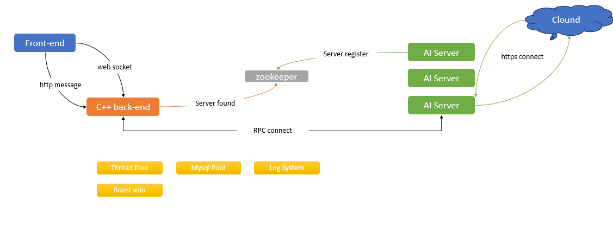

# 项目说明
项目为练手项目，参照[servertech-chat](https://github.com/anarthal/servertech-chat?tab=readme-ov-file)并在此基础上进行相关功能的更新

# 结构示意

| 日期           | 新增功能                 | 后续计划              |
|----------------|--------------------------| -----------------------|
| 2025年4月3日   | 添加数据库连接池      |            /              |
| 2025年4月5日   | 增加线程池demo，后续准备切换至协程处理IO + 线程池处理CPU密集型业务的工作方式 |        /            |
| 2025年4月6日   | 日志系统增加，前端双写 + 后端异步写入样例完成 |线程池接入后端日志接口 --> 增加定时I/O任务接口，统一管理处理的定时I/O任务与非定时I/O任务至指定I/O上下文中执行 |
| 2025年4月9日   | rpc使用学习案例添加，[详见此处](server/tools/rpc/readme.md) | ①线程池接入后端日志接口 --> 增加定时I/O任务接口，统一管理处理的定时I/O任务与非定时I/O任务至指定I/O上下文中执行   ②增加rpc和zookeeper注册服务，将ai业务解耦至其他服务器中，通过zookeeper来订阅服务，并增加线程池调用接口|
| 2025年4月12日   | 退出登陆时redis缓存删除  日志系统成功接入      |   ①线程池部分还未接入，目前还没有需要长时间的业务需要操作，后续可能的实现思路就是线程池里面分运行协程的线程和普通线程，然后普通线程的任务接口是需要传入对应的socket和协程上下文使得线程池能够提交异步任务  ②rpc部分在第一点完善之后接入，负责远端ai接口的调用与消息接收(主要目的是隔离ai环境)          |
| 2025年4月16日   | ①AI_server 完成http报文请求与回发，完成基本的云端大模型问答请求 ②boost 协程 + rpc框架示例[测试完成](./tools/rpc/) |   ①将rpc接入AI_server充当服务端，完成两侧开发任务的隔离   ②线程池部分要思考如何与协程接入配合                |
|2025年4月23日 | ①c++20协程学习,[参考资料-协程rpc](https://github.com/jsc723/coroutine-server), [参考资料-协程io_uring](https://github.com/Codesire-Deng/co_context)  ②zookeeper 测试代码加入| ①修改AI_server原本的异步流程demo，改成boost协程的形式并搭建rpc服务
|2025年4月26日| AI_server的rpc调用测试代码[验证通过](tools/rpc/ai_server/) | ①目前暂不考虑自己写无栈协程部分(需要自己写调度)，思考线程池与协程之间可以怎么配合  ②前端界面增加ai聊天功能

# 开发思路 
详细日志可在[此处查看](doc/开发日志.md)

# 编译说明

需要提前安装好以下组件

  boost Zookeeper protobuf redis mysql

其余部分补充中......
