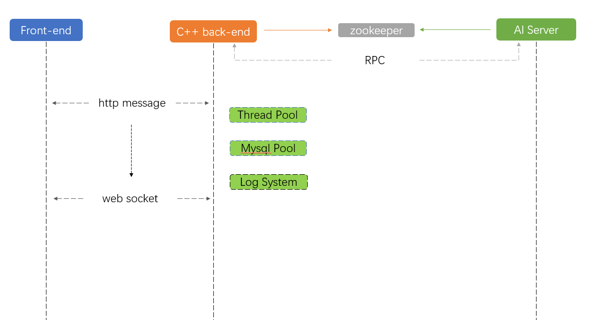

# 项目说明
项目为练手项目，参照[servertech-chat](https://github.com/anarthal/servertech-chat?tab=readme-ov-file)并在此基础上进行相关功能的更新

# 结构示意

# 功能完善
| 日期           | 新增功能                 | 后续计划              |
|----------------|--------------------------| -----------------------|
| 2025年4月3日   | 添加数据库连接池      |            /              |
| 2025年4月5日   | 增加线程池demo，后续准备切换至协程处理IO + 线程池处理CPU密集型业务的工作方式 |        /            |
| 2025年4月6日   | 日志系统增加，前端双写 + 后端异步写入样例完成 |线程池接入后端日志接口 --> 增加定时I/O任务接口，统一管理处理的定时I/O任务与非定时I/O任务至指定I/O上下文中执行 |
| 2025年4月9日   | rpc使用学习案例添加，[详见此处](server/tools/rpc/readme.md) | ①线程池接入后端日志接口 --> 增加定时I/O任务接口，统一管理处理的定时I/O任务与非定时I/O任务至指定I/O上下文中执行   ②增加rpc和zookeeper注册服务，将ai业务解耦至其他服务器中，通过zookeeper来订阅服务，并增加线程池调用接口|
| 2025年4月12日   | 退出登陆时redis缓存删除  日志系统成功接入      |   ①线程池部分还未接入，目前还没有需要长时间的业务需要操作，后续可能的实现思路就是线程池里面分运行协程的线程和普通线程，然后普通线程的任务接口是需要传入对应的socket和协程上下文使得线程池能够提交异步任务  ②rpc部分在第一点完善之后接入，负责远端ai接口的调用与消息接收(主要目的是隔离ai环境)          |

# 开发日志 
详细日志可在[此处查看](doc/devolopment.md)

# 编译说明
rpc子结构部分编译说明可参照[此处](./doc/rpc_build.md)

comming soon......
