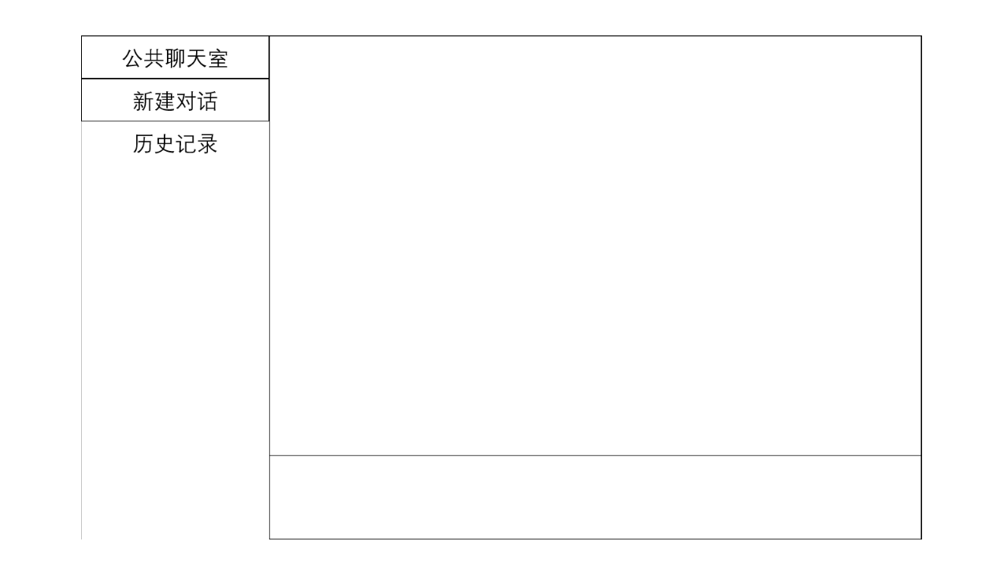

# 
rpc子结构部分编译说明可参照[此处](./doc/rpc_build.md)
# 2025年4月9日
现在的想法是最一个类似如下界面的东西

# 2025年4月11日
客户端聊天界面修改如下

后面需要补充一下退出登录时服务端从redis那边删除一下登录缓存

## 待实现的想法
| 功能           | 实现思路               | 
|----------------|--------------------------|
|  zookeeper子节点删除回调          |         zoo_get_children调用修改为 zoo_wget_children，并增加本地服务器缓存列表，每次连接失败的时候就选择下一个可用的服务器进行连接，同时增加回调，在服务宕机的时候通知客户端删除      | 
| 公共聊天室 |  这个就相当于一个主题id了，所有进入该聊天室的用户都相当于订阅了这个主题的消息，会同时向所有的用户推送|
| 历史记录 | 每个用户都有自己的历史对话记录，这一部分通过mysql存储？ |
| 问答环节 | 通过一轮信息提取分割好回答的部分，将较为通用的部分通过redis给存储起来(提前设定好什么是比较通用的)，没有的就再通过ai的api去调用| 