# 日志

## 总览
主要是实现以下界面，并将其中的ai功能通过rpc的方式解耦到其他服务器上面
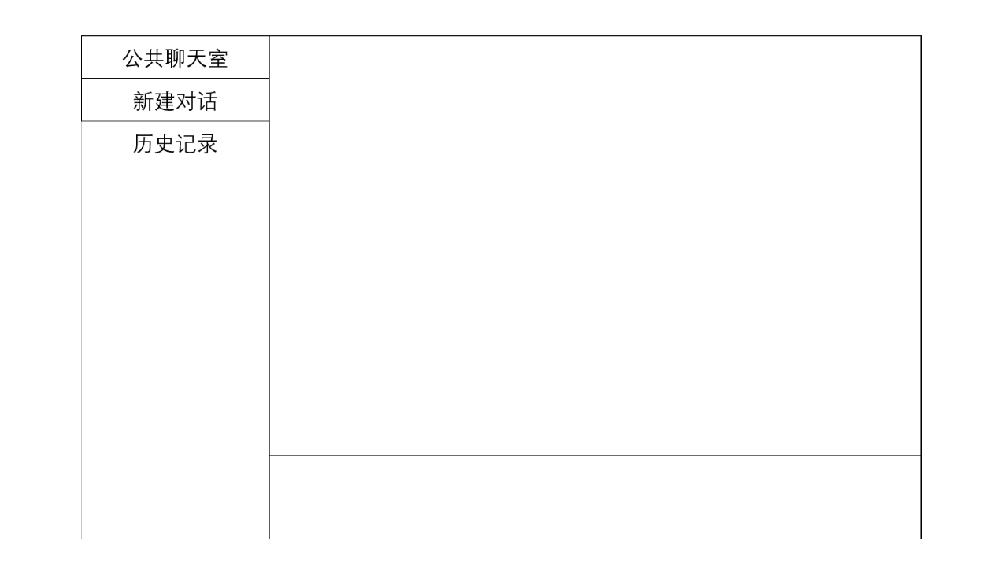

## 1. RPC框架部分
这是最简单的客户端、服务端流程，发送的数据就是对应的requset和response
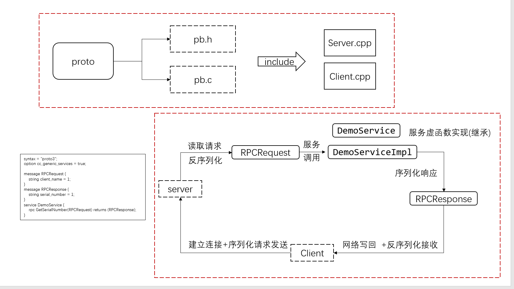

套上一层手动解析之后，使得其能够调用不同的服务和方法，新流程如下([这里学习参考的是goya-rpc的实现](https://github.com/goyas/goya-rpc))
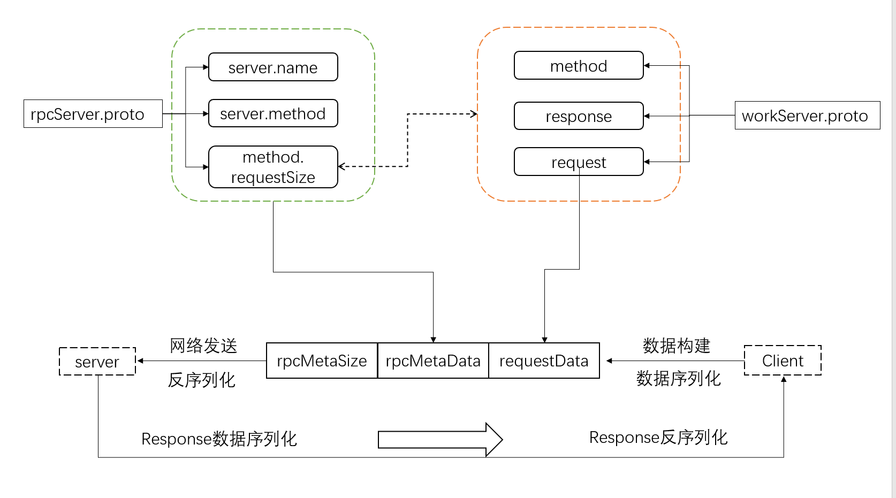

最后我们是使用zookeeper来当注册中心，就是客户端不必直接存储服务端的ip和接口了，向注册中心订阅该服务即可，框架流程如下
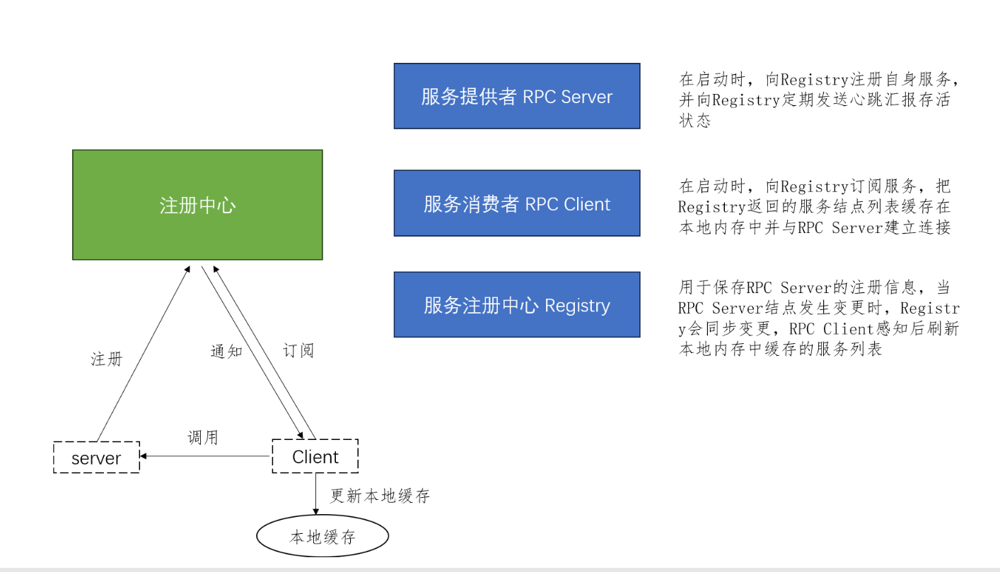

## 2. 日志系统部分

在流对象的析构函数处自动将日志消息添加到日志系统的两个环形缓冲区内，由后台协程定时消费并写入到磁盘
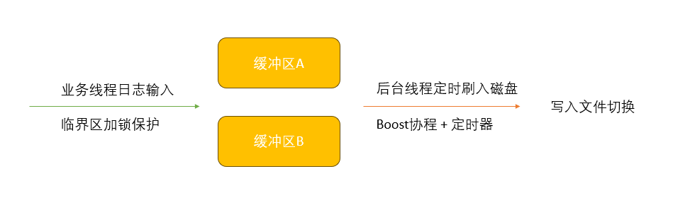

## 3. 服务调用部分
由于rpc是无状态的，对于目前采取云端模型调用而言，需要传输用户的api_key, 另外ai服务器那边也需要存档，即存储用户id、会话id，同时ai服务器后续可能需要提供历史记录、上下文记忆等功能，每次都发送这么长的信息不现实，另外也是为了功能解耦，将与ai服务有关的都迁移至另一台服务器上。故采用和用户初始登录一样的做法，用户调用初始配置申请后，ai服务器返回一个会话session_id,随后网页后端每次就只需要传输当前与ai服务器的会话ai即可完成对应的服务申请
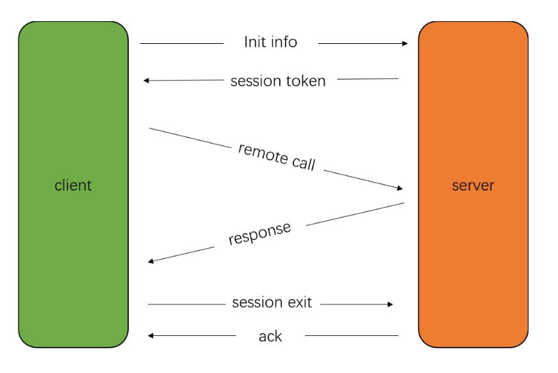

    对于单次远程调用，因为网页和后端之间是用websocket建立的长连接，故这里选用回调的方式，即另起一个协程同时创建回发消息的回调函数，等rpc远程调用结果返回时候执行此回调函数
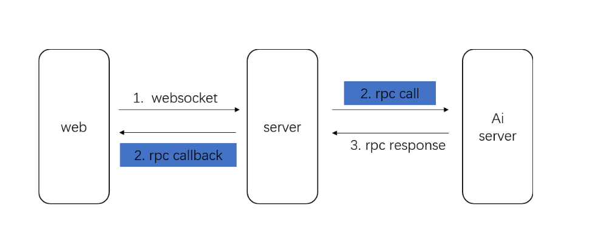

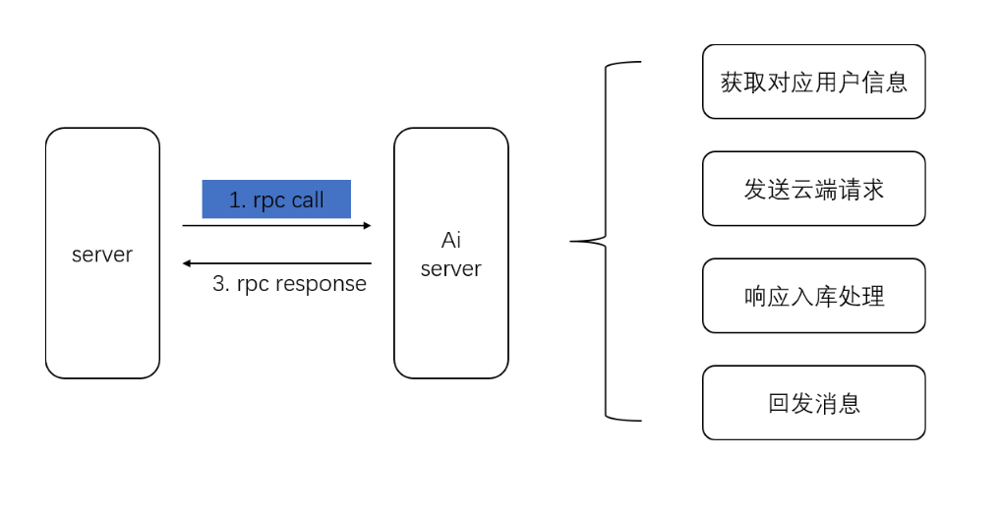

## 4. 关于协程和线程池的配合
目前的想法就是，协程将任务提交至线程池，同时设置一个定时器(没有时间的那种，或者说是信号)，然后线程池要支持普通任务和带有回调的任务，有回调的时候执行完成的时候执行回调去恢复对应的协程，然后协程提交完之后就使用co_await去等待线程池的任务完成
 这里的这个恢复，由于我们是使用的boost协程，所以我们这里只能让boost来恢复，后续如果有时间的话可以抛弃boost自己写协程调度的话就可以自己控制什么时候恢复了，那个时候就不需要信号了
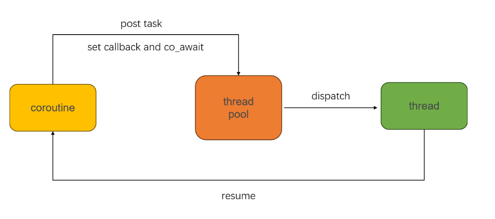

## 5. Redis连接池部分
这里主要就是维护了一下最少支持的连接数量，同时设置定时器定时清理那些长时间未使用的连接(也许可以加一个LRU？这里没必要LRU，每个连接都是一样的)
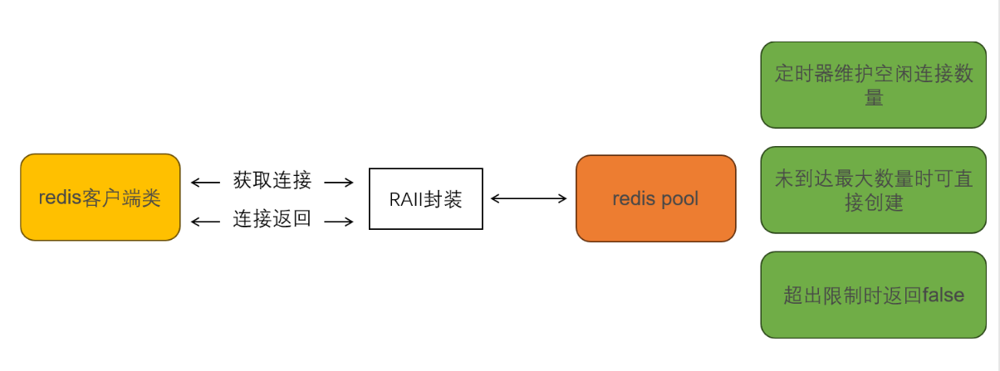
这里要补充的一点的，由于boost的redis命名空间内的connection不支持移动语义，所以std::move之后使用会直接访问到无效内存。
 这里需要利用RAII的方式，先封装成智能指针，然后智能指针再封装一层，直接用智能指针的话在指针析构的时候会面临着是直接是否析构还是返回到连接池的问题(再套一层的话我们只需要判断当前大小是否满足然后把执政指针给塞回去就可以
 如果直接用智能指针，走到析构这一步的话实际上已经没有对象持有了，需要重新构造一个智能指针出来然后返回，比较麻烦)

## NN 协程学习部分(待补充)
这里的描述是c++20无栈协程的部分
 有栈协程的原理基本上跟函数调用+内核线程切换时差不多，无栈协程类似于状态机跳转，故需要记录跳转点，且同一个线程上面的无栈协程是共用一个线程栈的，每个协程的协程帧和线程栈相比开销很少。深入理解的话搜索学习操作系统函数调用/进程切换的栈变化过程。
 协程栈切换部分的理解参考的是[这里](https://zhuanlan.zhihu.com/p/693105590)
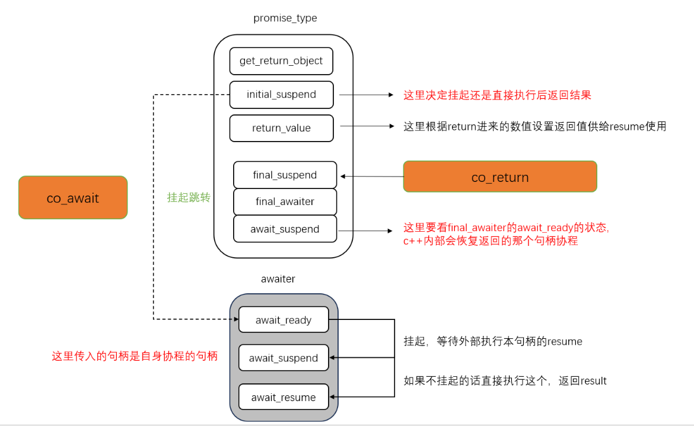