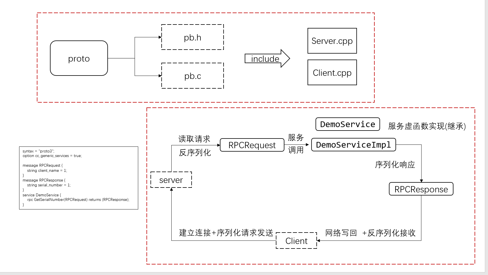
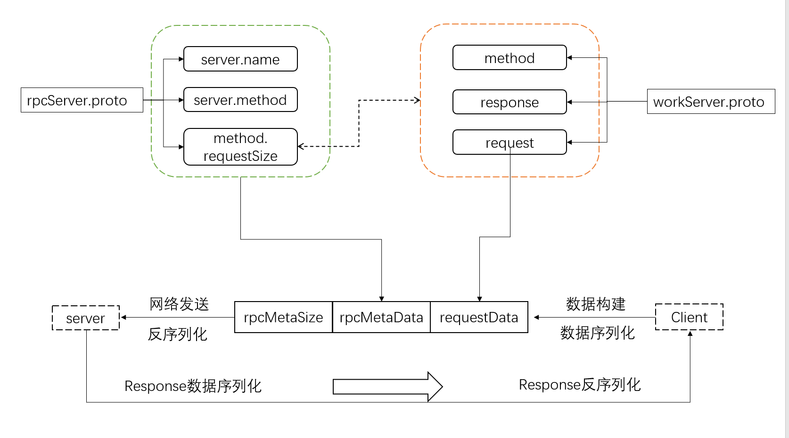
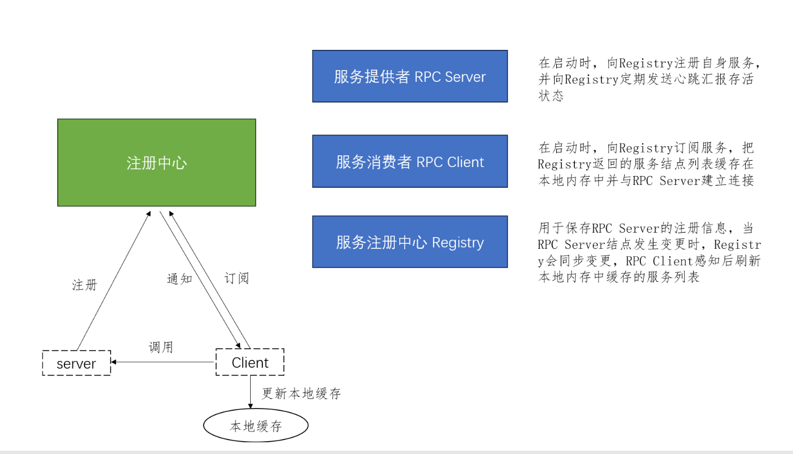

# RPC使用案例
此目录为rpc使用的学习测试程序，需要自己安装好proto并替换CMakelists中的库文件目录

# 流程示意
这是最简单的客户端、服务端流程，发送的数据就是对应的requset和response

套上一层手动解析之后，使得其能够调用不同的服务和方法，新流程如下([这里学习参考的是goya-rpc的实现](https://github.com/goyas/goya-rpc))

最后我们是使用zookeeper来当注册中心，就是客户端不必直接存储服务端的ip和接口了，向注册中心订阅该服务即可，框架流程如下
